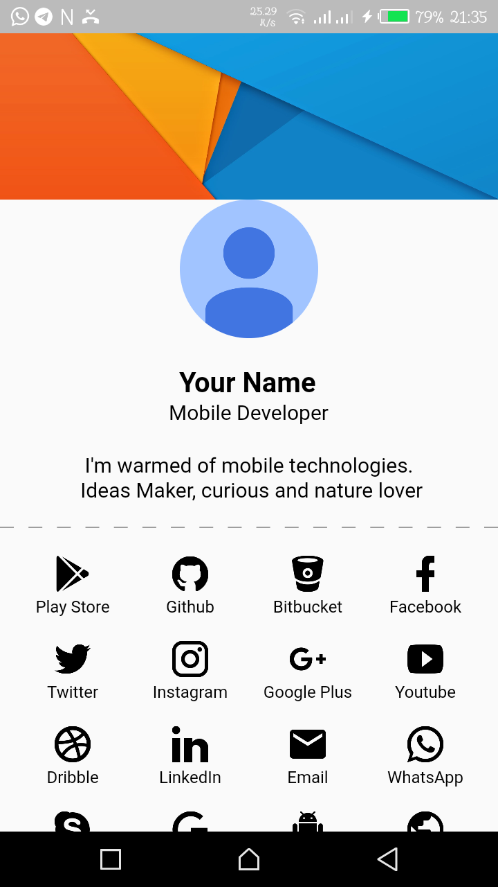
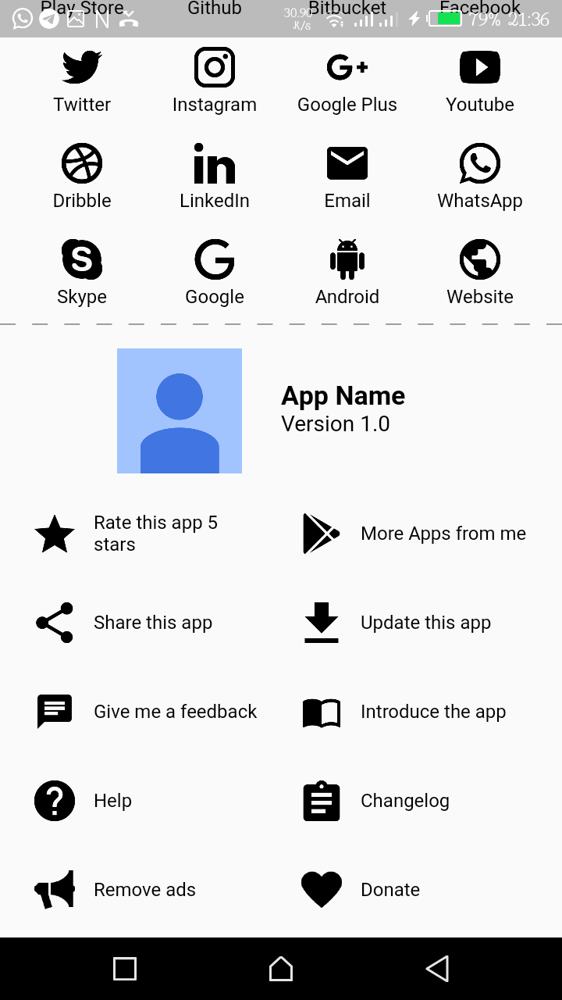
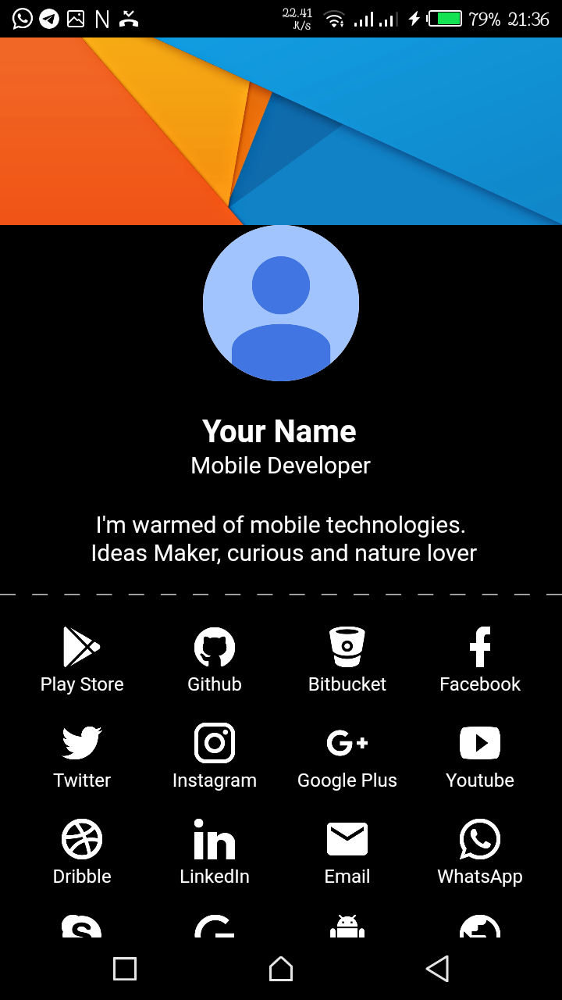
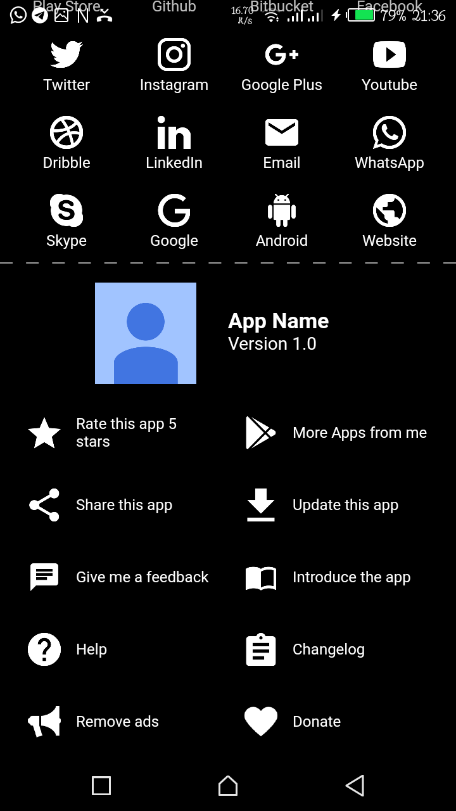

# ✨Flutter ‍Material About [](http://makeapullrequest.com) [](https://travis-ci.com/JideGuru/material-about) [](https://pub.dartlang.org/packages/material_about)
This is an [Flutter](http://www.flutter.io) project. You, as a mobile developer, can use this library to show a material about screen in your apps. It was built to make your life easier when introducing you to your users, and also, to create an about screen pattern for material android apps. It's really simple and dynamic, check it out.

Highly inspired by this [Android Library](https://github.com/jrvansuita/MaterialAbout)


## 📷 ScreenShots
<table>
  <tr>
    <td align="center">
      
    </td>
    <td align="center">
      
    </td>
  </tr>
  <tr>
    <td align="center">
       
    </td>
    <td align="center">
       
    </td>
  </tr>
</table>

## 🎖 Setup
```
dependencies:
  material_about: latest_version
```

## 🎮 Implementation

1. Import it
```
import 'package:material_about/material_about.dart';
```


2. Use the widget anywhere

```
MaterialAbout(
  banner: Image.asset(
    'images/profile_cover.jpg',
    height: 120.0,
    width: MediaQuery.of(context).size.width,
    fit: BoxFit.fill,
  ),
  dp: Image.asset(
    "images/profile_picture.png",
    height: 190.0,
    fit: BoxFit.fill,
  ),
  name: "Your Name",
  position: "Mobile Developer",
  description: "I'm warmed of mobile technologies. \n Ideas Maker, curious and nature lover",
  seperatorColor: Colors.grey,
  iconColor: Colors.black,
  textColor: Colors.black,
  playstoreID: "1111111111111",
//        github: "YourID", //e.g JideGuru
//        bitbucket: "YourID",
//        facebook: "YourID", //e.g jideguru
//        twitter: "YourID", //e.g JideGuru
//        instagram: "yourID", //e.g jideguru
//        googlePlus: "yourID",
  youtube: "yourID",
  dribble: "yourID",
  linkedin: "yourID",
  email: "yourEmail",
  whatsapp: "yournumber", //without international code e.g 22994684468.
  skype: "yourID",
  google: "yourSearchQuery",
  android: "yourID",
  website: "yourURL",
  appIcon: "images/profile_picture.png",
  appName: "App Name",
  appVersion: "1.0",
//        removeAds: "Link to pro app",
  donate: "Link to any wallet for donations",
//        changelog: "Link to changeLog",
  help: "Link to about app", //to be improved soon
  share: "Text to share to people",
  devID: "YourPlaystoreDevID",
),
```

## 📱Sample app
See Full Implementation in the [Sample App](https://github.com/JideGuru/material-about/tree/master/example)


## 💰Donate

If you like this project you can take out a few minutes to buy me a cup of coffee and keep me going

| Mode | Link/Wallet|
| ------| ------------|
| Bitcoin | 3GrziPW6Gz6S5mXo2EsiYpafW8vXVq5Rbv|

## Credits
1. [jrvansuita](https://github.com/jrvansuita) for his awesome [library](https://github.com/jrvansuita/MaterialAbout)

## 🐛 Bugs/Requests

If you encounter any problems feel free to open an issue. If you feel the library is
missing a feature, please raise a ticket on Github and I'll look into it.
Pull request are also welcome.

### ❗️ Note

For help getting started with Flutter, view the online
[documentation](https://flutter.io/).

For help on editing plugin code, view the [documentation](https://flutter.io/platform-plugins/#edit-code).

## ⭐️ License
MIT Licence